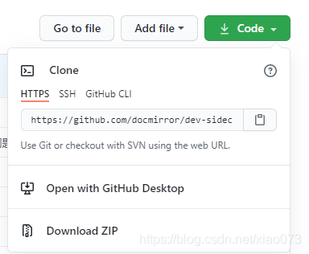
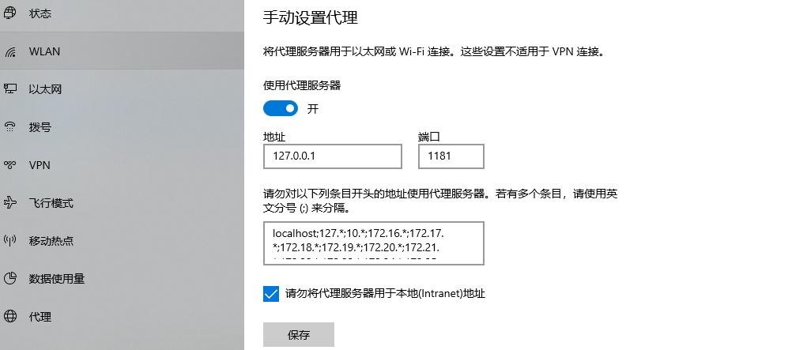

# dev-sidecar
开发者边车，命名取自service-mesh的service-sidecar，意为为开发者打辅助的边车工具    
通过本地代理的方式将http请求代理到一些国内的加速通道上    
不用`ｆａｎ qiang`也能解决一些网站和库无法访问或访问速度慢的问题

<a href='https://gitee.com/docmirror/dev-sidecar'></a>
<a href='https://github.com/docmirror/dev-sidecar'></a>
    
      

## 特性

### 1、 dns优选
根据网络状况智能解析最佳域名ip地址，获取最佳网络速度     

建议遇到打开比较慢的国外网站，可以优先尝试将该域名添加到dns设置中（注意：被GFW封杀的无效）      

### 2、 请求拦截
拦截打不开的网站，代理到加速镜像站点上去。    
可配置多个镜像站作为备份    
具备测速机制，当访问失败或超时之后，自动切换到备用站点。    
使得目标服务高可用

### 3、 github加速
* release、source、zip下载加速
* clone 加速
* 头像加速
* 解决readme中图片引用无法加载的问题
* gist.github.com 加速
* 解决git push 偶尔失败需要输入账号密码的问题（fatal: TaskCanceledException encountered  /  fatal: HttpRequestException encountered）
* raw/blame加速

### 4、 Stack Overflow 加速
* 将ajax.google.com代理到加速CDN上     
* recaptcha 图片验证码加速

### 5、 npm加速
* 支持开启npm代理
* 切换npm淘宝registry
* 某些npm install的时候，并且使用cnpm也无法安装时，可以尝试开启npm代理再试

### 6、 更多加速配置
等你来提issue

## 快速开始
目前仅支持windows
### DevSidecar桌面应用
 
#### 1 下载安装包  

下载安装包：    
[阿里云](https://dev-sidecar.docmirror.cn/update/DevSidecar-1.2.0.exe)  
[Gitee Release](https://gitee.com/docmirror/dev-sidecar/releases)  
[Github Release](https://github.com/docmirror/dev-sidecar/releases)  

安装后打开


     

#### 2 安装根证书     
       
第一次打开会提示安装证书，根据提示操作即可  
 

>根证书是本地随机生成的，所以不用担心根证书的安全问题  


#### 3 开始加速吧      
去试试打开github   
 
---------
>第一次访问会去国外的dns服务器上获取ip，会比较慢一点，后面就快了 
---------

### 开启前 vs 开启后 
 
|  | 开启前 | 开启后 |
| ---- | ---- | ---- |
|头像|  |  |
|clone | |    |  
|zip 下载 | |秒下的，实在截不到速度的图    |  


## 最佳实践

把dev-sidecar一直开着就行了    
建议遇到打开比较慢的国外网站，可以优先尝试将该域名添加到dns设置中（注意：被GFW封杀的无效）      
如果还访问不了，就需要寻找镜像cdn进行拦截代理    
 
### npm加速
 1. yarn 设置淘宝镜像registry
 2. npm设置官方registry。 
 3. 项目install使用yarn，发布包publish用npm，互不影响
 4. 某些库用cnpm也下载不下来的话，可以试试打开dev-sidecar的npm加速
 
### 其他加速
 1. git clone 加速      
 
 方式1：快捷复制：     
    开启脚本支持，然后在复制clone链接下方，即可复制到加速链接    
 方式2：
  > 使用方式用实际的名称替换{}的内容，即可加速clone  
  > https://hub.fastgit.org/{username}/{reponame}.git     
  > clone 出来的 remote "origin" 为fastgit的地址，需要手动改回来  
  > 你也可以直接使用他们的clone加速工具 [fgit-go](https://github.com/FastGitORG/fgit-go)

 2. github.com的镜像网站(注意：不能登录)   
   >1. [hub.fastgit.org](https://hub.fastgit.org/) 
   >2. [github.com.cnpmjs.org](https://github.com.cnpmjs.org/) 这个很容易超限


## api

### 拦截配置
没有配置域名的不会拦截，其他根据配置进行拦截处理
```js
const intercepts = {
  // 要拦截的域名
  'github.com': {
     //需要拦截url的正则表达式
     '/.*/.*/releases/download/': {
        //拦截类型
        // redirect:url,  临时重定向(url会变，一些下载资源可以通过此方式配置)
        // proxy:url,     代理（url不会变，没有跨域问题）
        // abort:true,    取消请求（适用于被GFW封锁的资源，找不到替代，直接取消请求，快速失败，节省时间）
        // success:true,  直接返回成功请求（某些请求不想发出去，可以伪装成功返回）
        redirect: 'download.fastgit.org'
      },
   },
   'ajax.googleapis.com': {
     '.*': {
       proxy: 'ajax.loli.net', //代理请求，url不会变
       backup: ['ajax.proxy.ustclug.org'], //备份，当前代理请求失败后，将会切换到备用地址
       test: 'ajax.googleapis.com/ajax/libs/jquery/1.12.4/jquery.min.js',
       replace:'/(.*)/xxx'//当加速地址的链接和原链接不是完全相同时，可以通过正则表达式replace，此时proxy通过$1$2来重组url， proxy:'ajax.loli.net/xxx/$1'
     }
   },
   'clients*.google.com': {
      '.*':{
        abort: true //取消请求，被GFW封锁的资源，找不到替代，直接取消请求，快速失败，节省时间
      }
    }       
}
```

### DNS优选配置
某些域名解析出来的ip会无法访问，（比如api.github.com会被解析到新加坡的ip上，新加坡的服务器在上午挺好，到了晚上就卡死，基本不可用）        
通过从dns上获取ip列表，切换不同的ip进行尝试，最终会挑选到一个最快的ip

```js
 dns: {
    mapping: {
      //
      'api.github.com': 'usa', // "解决push的时候需要输入密码的问题",
      'gist.github.com': 'usa' // 解决gist无法访问的问题
      "*.githubusercontent.com": "usa" // 解决github头像经常下载不到的问题
    }
  },
```
注意：暂时只支持IPv4的解析

## 问题排查
如果没有加速效果，请根据以下步骤进行排查     

#### 1、请确认windows的代理设置处于勾选状态     
如果已经是勾选状态，那么先取消勾选确定，然后再勾选确定，再尝试查看是否有加速效果（目前win7必需要手动开关一下）。  
 如何打开查看windows代理设置：    
 * win10: 开始->设置->网络和Internet->最下方代理      
 * win7: 开始->控制面板->网络和Internet->网络和共享中心->左下角Internet选项->连接选项卡->局域网设置      

    
   
   
#### 2. 360软件会严重拖慢设置代理命令的执行时间   
如果开启了360，那么软件开启windows代理的时间会特别长，需要耐心等待。    

#### 3.如果还是不行，请在下方加作者好友，将服务日志发送给作者进行分析          
 日志打开方式：加速服务->右边日志按钮->另存为    
 
      

## 联系作者

欢迎bug反馈，需求建议，技术交流等（请备注dev-sidecar，或简称DS）      

      


## 感谢
本项目使用lerna包管理工具   

[](https://lerna.js.org/)

本项目参考如下开源项目
* [node-mitmproxy](https://github.com/wuchangming/node-mitmproxy)   
* [ReplaceGoogleCDN](https://github.com/justjavac/ReplaceGoogleCDN)
* [github增强油猴脚本](https://greasyfork.org/zh-CN/scripts/412245-github-%E5%A2%9E%E5%BC%BA-%E9%AB%98%E9%80%9F%E4%B8%8B%E8%BD%BD)

本项目加速资源由如下组织提供
* [fastgit](https://fastgit.org/)
