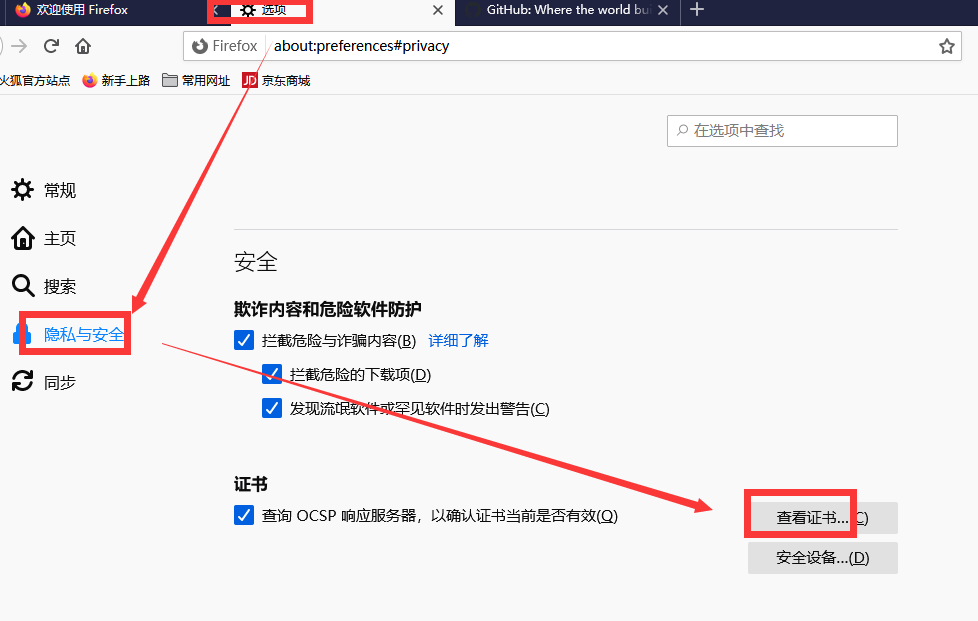
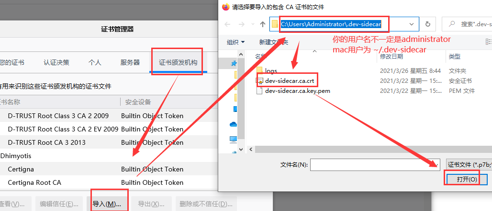
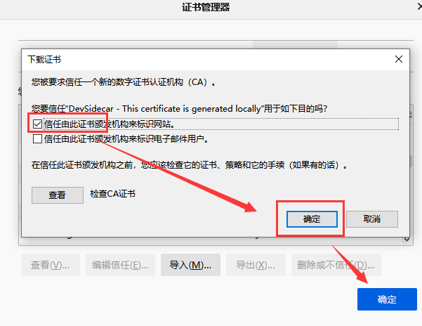

# dev-sidecar

开发者边车，命名取自service-mesh的service-sidecar，意为为开发者打辅助的边车工具（以下简称ds）
通过本地代理的方式将https请求代理到一些国内的加速通道上

<a href='https://github.com/docmirror/dev-sidecar'></a>

[](https://www.star-history.com/#docmirror/dev-sidecar&type=date&legend=top-left)

> Gitee上的同步项目已被封禁，请认准本项目唯一官方仓库地址[https://github.com/docmirror/dev-sidecar](https://github.com/docmirror/dev-sidecar) 【狗头保命】
>
> 我将继续奋战在开源一线，为社区贡献更多更好的开源项目。
>
> 感兴趣的可以关注我的主页 [【github】](https://github.com/greper) [【gitee】](https://gitee.com/greper)

## 打个广告

> [https://github.com/certd/certd](https://github.com/certd/certd)
>
> 我的开源证书管理工具项目，全自动申请和部署证书，有需求的可以去试试，帮忙点个star

## 重要提醒

> ------------------------------重要提醒1---------------------------------
>
> 注意：由于electron无法监听windows的关机事件，开着ds情况下直接重启电脑，会导致无法上网，你可以手动启动ds即可恢复网络，你也可以将ds设置为开机自启。
>
> 关于此问题的更多讨论请前往：[https://github.com/docmirror/dev-sidecar/issues/109](https://github.com/docmirror/dev-sidecar/issues/109)
>
> 注：此问题已在 `1.8.9` 版本中得到解决。

> ------------------------------重要提醒2---------------------------------
>
> 注意：本应用启动会自动修改系统代理，所以会与其他代理软件有冲突，一起使用时请谨慎使用。
>
> 与Watt Toolkit（原Steam++）共用时，请以hosts模式启动Watt Toolkit
>
> 与TUN网卡模式运行的游戏加速器可以共用
>
> 本应用主要目的在于直连访问github，如果你已经有飞机了，那建议还是不要用这个自行车（ds）了

## 一、 特性

### 1.1、 dns优选（解决\*\*\*污染问题）

- 根据网络状况智能解析最佳域名ip地址，获取最佳网络速度
- 解决一些网站和库无法访问或访问速度慢的问题
- 建议遇到打开比较慢的国外网站，可以优先尝试将该域名添加到dns设置中（注意：被\*\*\*封杀的无效）

### 1.2、 请求拦截

- 拦截打不开的网站，代理到加速镜像站点上去。
- 可配置多个镜像站作为备份
- 具备测速机制，当访问失败或超时之后，自动切换到备用站点，使得目标服务高可用

### 1.3、 github加速

- github 直连加速 (通过修改sni实现，感谢 [fastGithub](https://github.com/dotnetcore/FastGithub) 提供的思路)
- release、source、zip下载加速
- clone 加速
- 头像加速
- 解决readme中图片引用无法加载的问题
- gist.github.com 加速
- 解决git push 偶尔失败需要输入账号密码的问题（fatal: TaskCanceledException encountered / fatal: HttpRequestException encountered）
- raw/blame加速

> 以上部分功能通过 `X.I.U` 的油猴脚本实现， 以下是仓库和脚本下载链接，大家可以去支持一下。
>
> - [https://github.com/XIU2/UserScript](https://github.com/XIU2/UserScript)
> - [https://greasyfork.org/scripts/412245](https://greasyfork.org/scripts/412245)
>
> 由于此脚本在ds中是打包在本地的，更新会不及时，你可以直接通过浏览器安装油猴插件使用此脚本，从而获得最新更新（ds本地的可以通过 `加速服务->基本设置->启用脚本` 进行关闭）。

### 1.4、 Stack Overflow 加速

- 将ajax.google.com代理到加速CDN上
- recaptcha 图片验证码加速

### 1.5、 npm加速

- 支持开启npm代理
- 官方与淘宝npm registry一键切换
- 某些npm install的时候，并且使用cnpm也无法安装时，可以尝试开启npm代理再试

**_安全警告_**：

- 请勿使用来源不明的服务/远程配置地址，有隐私和账号泄露风险
- 本应用及服务/默认远程配置端承诺不收集任何信息。介意者请使用安全模式。

## 二、快速开始

支持windows、Mac、Linux(Ubuntu)

### 2.1、DevSidecar桌面应用

#### 1）下载安装包

- release下载
  [Github Release](https://github.com/docmirror/dev-sidecar/releases)

> Windows: 请选择DevSidecar-x.x.x-windows-universal.exe
>
> Mac: 请选择DevSidecar-x.x.x-macos-universal.dmg
>
> Debian系及其他支持deb安装包的Linux: 请选择DevSidecar-x.x.x-linux-[架构].deb
>
> 其他Linux: 请选择DevSidecar-x.x.x-linux-[架构].AppImage (未做测试，不保证能用)

> linux安装说明请参考 [linux安装文档](./doc/linux.md)

> 注意：由于没有买应用证书，所以应用在下载安装时会有“未知发行者”等安全提示，选择保留即可。

#### 2）安装后打开

界面应大致如下图所示：

> 注意：mac版安装需要在“系统偏好设置->安全性与隐私->通用”中解锁并允许应用安装


#### 3）安装根证书

第一次打开会提示安装证书，根据提示操作即可

更多有关根证书的说明，请参考 [为什么要安装根证书?](./doc/caroot.md)

> 根证书是本地随机生成的，所以不用担心根证书的安全问题（本应用不收集任何用户信息）
>
> 你也可以在加速服务设置中自定义根证书（PEM格式的证书与私钥）

> 火狐浏览器需要[手动安装证书](#3火狐浏览器火狐浏览器不走系统的根证书需要在选项中添加根证书)

#### 4）开始加速吧

去试试打开github、huggingface、docker hub吧

### 2.2、开启前 vs 开启后

|          |             开启前             |                      开启后                      |
|:--------:|:------------------------------:|:------------------------------------------------:|
|   头像   |          |                            |
|  clone   |     |                              |
| zip 下载 |  | 秒下的，实在截不到速度的图 |

## 三、模式说明

### 3.1、安全模式

- 此模式：关闭拦截、关闭增强、不使用远程配置、开启dns优选、开启测速
- 最安全，无需安装证书，可以在浏览器地址栏左侧查看域名证书
- 功能也最弱，只有特性1，相当于查询github的国外ip，手动改hosts一个意思。
- github的可访问性不稳定，取决于IP测速，如果有绿色ip存在，就 `有可能` 可以直连访问。
  

### 3.2、默认模式

- 此模式：开启拦截、关闭增强、使用远程配置、开启dns优选、开启测速
- 需要安装证书，通过修改sni直连访问github
- 功能上包含特性1/2/3/4。

## 四、 最佳实践

- 把dev-sidecar一直开着就行了
- 建议遇到打开比较慢的国外网站，可以尝试将该域名添加到dns设置中（注意：被\*\*\*封杀的无效）

### 其他加速

#### 1）git clone 加速

- 方式1：快捷复制：

  > 开启脚本支持，然后在复制clone链接下方，即可复制到加速链接

- 方式2：

  > 1. 使用方式：用实际的名称替换 `{}` 的内容，即可加速clone [https://hub.fastgit.org/{username}/{reponame}.git](https://hub.fastgit.org/%7Busername%7D/%7Breponame%7D.git)
  > 2. clone 出来的 remote "origin" 为fastgit的地址，需要手动改回来
  > 3. 你也可以直接使用他们的clone加速工具 [fgit-go](https://github.com/FastGitORG/fgit-go)

#### 2）`github.com` 的镜像网站（注意：部分镜像网站不能登录）

> 1. [hub.fastgit.org](https://hub.fastgit.org/) （2024/11/18：这个好像失效了？）
> 2. [github.com.cnpmjs.org](https://github.com.cnpmjs.org/) 这个很容易超限（2024/11/18：这个好像失效了？）
> 3. [dgithub.xyz](https://dgithub.xyz/)

## 五、api

### 5.1、拦截配置

没有配置域名的不会拦截，其他根据配置进行拦截处理。

在【加速服务-拦截设置】中配置，格式如下：（更多内容参见[wiki](https://github.com/docmirror/dev-sidecar/wiki/%E5%8A%A0%E9%80%9F%E6%9C%8D%E5%8A%A1%E4%BD%BF%E7%94%A8%E8%AF%B4%E6%98%8E)）

```jsonc
{
  // 要拦截的域名
  "github.com": {
    // 需要拦截url的正则表达式
    "/.*/.*/releases/download/": {
      // 拦截类型
      // redirect: url,          // 临时重定向（url会变，一些下载资源可以通过此方式配置）
      // proxy: url,             // 代理（url不会变，没有跨域问题）
      // abort: true,            // 取消请求（适用于被***封锁的资源，找不到替代，直接取消请求，快速失败，节省时间）
      // success: true,          // 直接返回成功请求（某些请求不想发出去，可以伪装成功返回）
      // cacheDays: 1,           // GET请求的使用缓存，单位：天（常用于一些静态资源）
      // options: true,          // OPTIONS请求直接返回成功请求（该功能存在一定风险，请谨慎使用）
      // optionsMaxAge: 2592000, // OPTIONS请求缓存时间，默认：2592000（一个月）
      "redirect": "download.fastgit.org"
    },
    ".*": {
      "proxy": "github.com",
      "sni": "baidu.com" // 修改sni，规避***握手拦截
    }
  },
  "ajax.googleapis.com": {
    ".*": {
      "proxy": "ajax.loli.net", // 代理请求，url不会变
      "backup": ["ajax.proxy.ustclug.org"], // 备份，当前代理请求失败后，将会切换到备用地址
      "test": "ajax.googleapis.com/ajax/libs/jquery/1.12.4/jquery.min.js",
      "replace": "/(.*)/xxx"// 当加速地址的链接和原链接不是完全相同时，可以通过正则表达式replace，此时proxy通过$1$2来重组url， proxy:'ajax.loli.net/xxx/$1'
    }
  },
  "clients*.google.com": {
    ".*": {
      "abort": true // 取消请求，被***封锁的资源，找不到替代，直接取消请求，快速失败，节省时间
    }
  }
}
```

### 5.2、DNS优选配置

某些域名解析出来的ip会无法访问，（比如api.github.com会被解析到新加坡的ip上，新加坡的服务器在上午挺好，到了晚上就卡死，基本不可用）

通过从dns上获取ip列表，切换不同的ip进行尝试，最终会挑选到一个最快的ip（该功能需要事先配置好所用DNS），更多说明参见[wiki](https://github.com/docmirror/dev-sidecar/wiki/%E5%8A%A0%E9%80%9F%E6%9C%8D%E5%8A%A1%E4%BD%BF%E7%94%A8%E8%AF%B4%E6%98%8E)

```json
{
  "dns": {
    "mapping": {
      "api.github.com": "cloudflare", // "解决push的时候需要输入密码的问题",
      "gist.github.com": "cloudflare", // 解决gist无法访问的问题
      "*.githubusercontent.com": "cloudflare" // 解决github头像经常下载不到的问题
    }
  }
}
```

注意：暂时只支持IPv4的解析

## 六、问题排查

### 6.1、dev-sidecar的前两个开关没有处于打开状态

1. 尝试将开关按钮手动打开
2. 请尝试右键dev-sidecar图标，点退出。再重新打开
3. 如果还不行，请将日志发送给作者

如果是mac系统，可能是下面的原因

#### 1）Mac系统使用时，首页的系统代理开关无法打开

出现这个问题可能是没有开启系统代理命令的执行权限

```
networksetup -setwebproxy 'WiFi' 127.0.0.1 31181
#看是否有如下错误提示
** Error: Command requires admin privileges.
```

如果有上面的错误提示，请尝试如下方法：

> 取消访问偏好设置需要管理员密码
>
> 系统偏好设置—>安全性与隐私—> 通用—> 高级—> 访问系统范围的偏好设置需要输入管理员密码（取消勾选）

### 6.2、没有加速效果

1. 本应用默认仅开启https加速，一般足够覆盖需求。
   如果你访问的是仅支持http协议的网站，请手动在【系统代理】中打开【代理HTTP请求】
2. 检查浏览器是否装了什么插件，与ds有冲突
3. 检查是否安装了其他代理软件，与ds有冲突
4. 请确认浏览器的代理设置为使用IE代理/或者使用系统代理状态
5. 可以尝试换个浏览器试试
6. 请确认网络代理设置处于勾选状态
   正常情况下ds在“系统代理”开关打开时，会自动设置系统代理。

### 6.3、浏览器打开提示证书不受信任


一般是证书安装位置不对，重新安装根证书后，重启浏览器

#### 1）windows: 请确认证书已正确安装在“本地计算机-将所有的证书都放入下列存储：受信任的根证书颁发机构”下

#### 2）mac: 请确认证书已经被安装并已经设置信任

#### 3）火狐浏览器：火狐浏览器不走系统的根证书，需要在选项中添加根证书

1. 火狐浏览器->选项->隐私与安全->证书->查看证书
   
2. 证书颁发机构->导入
3. 选择证书文件 `C:\Users(用户)\Administrator(你的账号)\.dev-sidecar\dev-sidecar.ca.crt`（Mac或linux为 `~/.dev-sidecar` 目录）
   
4. 勾选信任由此证书颁发机构来标识网站，确定即可
   

### 6.4、打开github显示连接超时

```html
DevSidecar Warning: Error: www.github.com:443, 代理请求超时
```

1. 检查测速界面github.com是否有ip ，如果没有ip，则可能是由于你的网络提供商封锁了dns服务商的ip（试试能否ping通：1.1.1.1 / 9.9.9.9 ）
2. 如果是安全模式，则是因为不稳定导致的，等一会再刷新试试
3. 如果是增强模式，则是由于访问人数过多，正常现象

### 6.5、查看日志是否有报错

如果还是不行，请在下方加官方QQ群或提issue，附上服务日志（server.log）以便进行分析

日志打开方式：加速服务->右边日志按钮->打开日志文件夹


### 6.6、某些原本可以打开的网站打不开了

1. 可以尝试关闭pac
2. 可以将域名加入白名单

### 6.7、应用意外关闭导致没有网络了

应用开启后会自动修改系统代理设置，正常退出会自动关闭系统代理
当应用意外关闭时，可能会因为没有将系统代理恢复，从而导致完全无法上网。

对于此问题有如下几种解决方案可供选择：

1. 重新打开应用即可（右键应用托盘图标可完全退出，将会正常关闭系统代理设置）
2. 如果应用被卸载了，此时需要[手动关闭系统代理设置](./doc/recover.md)
3. 如果你是因为开着ds的情况下重启电脑导致无法上网，你可以设置ds为开机自启

### 6.8、卸载应用后上不了网，git请求不了

如果你在卸载应用前，没有正常退出app，就有可能无法上网。请按如下步骤操作恢复您的网络：

1、关闭系统代理设置，参见：[手动关闭系统代理设置](./doc/recover.md)
2、执行下面的命令关闭git的代理设置（如果你开启过 `Git.exe代理` 的开关）

```shell
git config --global --unset http.proxy
git config --global --unset https.proxy
git config --global --unset http.sslVerify
```

3、执行下面的命令关闭npm的代理设置（如果你开启过npm加速的开关）

```shell
npm config delete proxy
npm config delete https-proxy
```

### 6.9、其他问题

请查阅[wiki](https://github.com/docmirror/dev-sidecar/wiki)

也可以查阅[有文档tag的issue](https://github.com/docmirror/dev-sidecar/issues?q=is%3Aissue%20label%3ADocumentation)，它们被开发者认证为相当于文档级别的参考issue。

## 七、在其他程序使用

- [java程序使用](./doc/other.md#Java程序使用)

## 八、贡献代码

### 8.1、准备环境

1. 安装 `nodejs`

推荐安装 nodejs `22.x.x` 的版本，其他版本未做测试

2. 安装 `pnpm`

运行如下命令即可安装所需依赖：

```shell
npm install -g pnpm --registry=https://registry.npmmirror.com

```

3. 安装 `git`, `Python3`

请根据你的操作系统，安装好 `git` 和 `python3` 环境并添加到环境变量。

**Windows用户请注意**，Windows系统自带一个占位用的Python.exe别名，用以在必要时下载Microsoft Store中的Python应用；该python.exe不能完成实际的Python运行。建议在设置-应用-高级应用设置-应用执行别名中关闭【应用安装程序-python.exe】与【应用安装程序-python3.exe】，然后手动安装Python，避免冲突。必要时可使用`where.exe python`命令确认python.exe的路径，形如`C:\Users\Nobody\AppData\Local\Microsoft\WindowsApps\python.exe`的即为虚假占位文件。

4. （对于Windows）安装Visual Studio MSVC Build Tools

**注意截止目前（2025年12月28日），node-gyp对Visual Studio 2025/18的支持还不完善**，建议安装Visual Studio 2022的Build Tools。直接在Visual Studio Installer中选择“使用C++的桌面开发”工作负载进行安装即可。

### 8.2、开发调试模式启动

运行如下命令即可开发模式启动

```shell
# 拉取代码
git clone https://github.com/docmirror/dev-sidecar

cd dev-sidecar

# 注意不要使用 `npm install` 来安装依赖，因为 `pnpm` 会自动安装依赖
pnpm install

# 运行DevSidecar
cd packages/gui
npm run electron

```

> 如果electron依赖包下载不动，可以开启ds的npm加速

### 8.3、打包成可执行文件

```shell
# 先执行上面的步骤，然后运行如下命令打包成可执行文件
npm run electron:build
```

### 8.4、常见问题

1. phantomjs 下载失败（Electron 安装提示）

如果在安装依赖时报错（以下以Windows平台为例）：

```shell
node_modules/.pnpm/electron@29.4.6/node_modules/electron: Running postinstall script...
node_modules/.pnpm/phantomjs-prebuilt@2.1.16/node_modules/phantomjs-prebuilt: Running install script, failed in 226ms
.../node_modules/phantomjs-prebuilt install$ node install.js
│ PhantomJS not found on PATH
│ Downloading https://github.com/Medium/phantomjs/releases/download/v2.1.1/phantomjs-2.1.1-windows.zip
│ Saving to %TEMP%\phantomjs\phantomjs-2.1.1-windows.zip
│ Receiving...
│ Error making request.
│ Error: [各种网络错误]
```

可尝试手动从显示的URL下载并移动到目标位置

2. `electron: Running postinstall script...` 卡死

形如以下情况下卡死，请耐心等待。**不要删除node_modules后重新安装！**

```shell
> pnpm i
Scope: all 5 workspace projects
Lockfile is up to date, resolution step is skipped
Packages: +1631
++++++++++++++++++++++++++++++++++++++++++++++++++++++++++++++++++++++++++++++++++++++++++++++++++++++++++++++++++++++++++++++++++++++++++++++++++++++
Progress: resolved 1631, reused 1631, downloaded 0, added 0, done
node_modules/.pnpm/electron@29.4.6/node_modules/electron: Running postinstall script...
node_modules/.pnpm/phantomjs-prebuilt@2.1.16/node_modules/phantomjs-prebuilt: Running install script, done in 487ms
```

3. Linux arm64 环境下Electron 安装提示错误（本节内容由AI生成，仅供参考）

如果你在 Linux arm64 上为 GUI 安装依赖遇到 Electron `postinstall` 崩溃（`double free or corruption`）或无法下载二进制，可按下面流程处理：

常见错误提示：

- `phantomjs-prebuilt`: Unexpected platform or architecture: linux/arm64，postinstall 失败。
- `electron` postinstall: double free or corruption (out) / Aborted (core dumped)。
  1. 使用与 Electron 安装脚本兼容的 Node 版本（建议 LTS 18）：

  ```shell
  nvm install 18.20.8
  nvm use 18.20.8
  corepack enable
  ```

  2. 修改 `.npmrc` 文件，添加如下内容：
  - `phantomjs_skip_download=true`：避免旧版 `phantomjs-prebuilt` 在 arm64/容器环境拉取二进制导致安装失败，建议保留。
  3. 正常安装 GUI 依赖（脚本需要开启）：

  ```shell
  pnpm install --filter @docmirror/dev-sidecar-gui
  ```

  4. 若依旧在下载阶段崩溃，可手动下载并解压 Electron 二进制：

  ```shell
  electron_dir="$(pwd)/node_modules/.pnpm/electron@29.4.6/node_modules/electron"
  rm -rf "$electron_dir/dist"
  curl -L --retry 3 --retry-delay 2 -o /tmp/electron-v29.4.6-linux-arm64.zip \
    https://github.com/electron/electron/releases/download/v29.4.6/electron-v29.4.6-linux-arm64.zip
  unzip -q /tmp/electron-v29.4.6-linux-arm64.zip -d "$electron_dir/dist"
  if [ -f "$electron_dir/dist/electron.d.ts" ]; then mv "$electron_dir/dist/electron.d.ts" "$electron_dir/electron.d.ts"; fi
  printf 'electron' > "$electron_dir/path.txt"
  ```

4. 运行时提示 `chrome-sandbox` 权限问题，可在本地开发时关闭沙箱：

```shell
# 开发/调试禁用沙箱（无需 root）
ELECTRON_NO_SANDBOX=1 pnpm -F @docmirror/dev-sidecar-gui run electron

# 或为 chrome-sandbox 设置 SUID（需要 root）
sudo chown root:root "$electron_dir/dist/chrome-sandbox"
sudo chmod 4755 "$electron_dir/dist/chrome-sandbox"
```

5. Termux/Android ARM64 运行 GUI（无 root）

- 预加载网络接口兜底、强制关闭 Electron 沙箱（无需 root，使用 HOME 路径）：

````bash
cd $HOME/dev-sidecar/packages/gui
NODE_OPTIONS="--require ${HOME:-/data/data/com.termux/files/home}/dev-sidecar/packages/gui/src/utils/os-network-fallback.cjs" \
ELECTRON_FORCE_NO_SANDBOX=1 ELECTRON_NO_SANDBOX=1 ELECTRON_DISABLE_SANDBOX=1 \
npm run electron

或使用简化命令（在 packages/gui 目录下）：

```bash
pnpm run electron:termux
````

若需在 Termux 尝试打包（不保证成功，缺少桌面依赖时可能失败）：

```bash
pnpm run electron:build:termux
```

- 说明：
  - Termux 缺少 setuid 能力，必须关闭沙箱，否则会提示 chrome-sandbox 权限错误。
  - `os-network-fallback.cjs` 会在 `uv_interface_addresses` 权限受限时返回回环接口，避免 node-ipc 崩溃。
  - 若仍需沙箱，只能在支持 setuid 的环境或 root 下运行。

### 8.5、提交pr

如果你想将你的修改贡献出来，请提交pr

## 九、联系作者

欢迎bug反馈，需求建议，技术交流等

加官方QQ群（请备注dev-sidecar，或简称DS）

- QQ 1群：390691483，人数：499 / 500（满）
- QQ 2群：667666069，人数：500 / 500（满）
- QQ 3群：419807815，人数：493 / 500（满）
- QQ 4群：[438148299](http://qm.qq.com/cgi-bin/qm/qr?_wv=1027&k=i_NCBB5f_Bkm2JsEV1tLs2TkQ79UlCID&authKey=nMsVJbJ6P%2FGNO7Q6vsVUadXRKnULUURwR8zvUZJnP3IgzhHYPhYdcBCHvoOh8vYr&noverify=0&group_code=438148299)，人数：700 / 1000
- QQ 5群：[767622917](http://qm.qq.com/cgi-bin/qm/qr?_wv=1027&k=nAWi_Rxj7mM4Unp5LMiatmUWhGimtbcB&authKey=aswmlWGjbt3GIWXtvjB2GJqqAKuv7hWjk6UBs3MTb%2Biyvr%2Fsbb1kA9CjF6sK7Hgg&noverify=0&group_code=767622917)，人数：200 / 200（new）

## 十、求star

我的其他项目求star

- [fast-crud](https://github.com/fast-crud/fast-crud) : 开发crud快如闪电
- [certd](https://github.com/certd/certd) : 让你的证书永不过期
- [trident-sync](https://github.com/handsfree-work/trident-sync) : 二次开发项目同步升级工具

## 十一、感谢

本项目曾使用lerna包管理工具

[](https://lerna.js.org/)

本项目参考如下开源项目

- [node-mitmproxy](https://github.com/wuchangming/node-mitmproxy)
- [ReplaceGoogleCDN](https://github.com/justjavac/ReplaceGoogleCDN)

特别感谢

- [github增强油猴脚本](https://greasyfork.org/zh-CN/scripts/412245-github-%E5%A2%9E%E5%BC%BA-%E9%AB%98%E9%80%9F%E4%B8%8B%E8%BD%BD) 本项目部分加速功能完全复制该脚本。
- [中国域名白名单](https://github.com/pluwen/china-domain-allowlist)，本项目的系统代理排除域名功能中，使用了该白名单。
- [gfwlist](https://github.com/gfwlist/gfwlist)，本项目的pac功能中，使用了该名单。

本项目部分加速资源由如下组织提供

- [FastGit UK](https://fastgit.org/)
