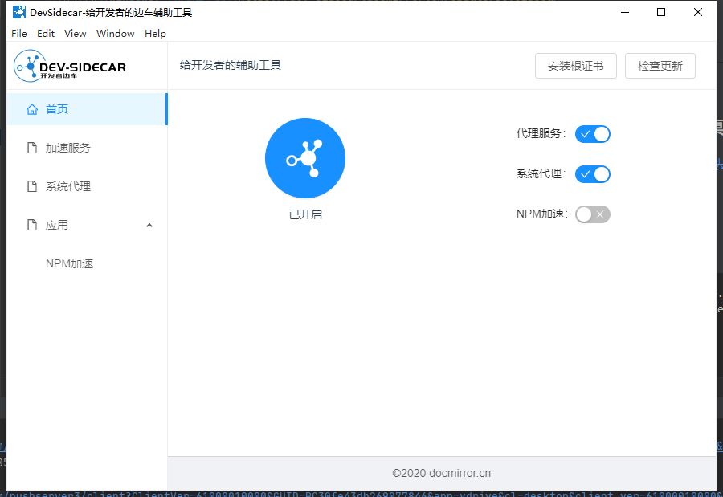
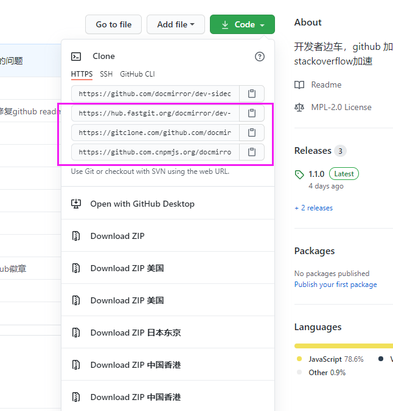

# dev-sidecar
开发者边车，命名取自service-mesh的service-sidecar，意为为开发者打辅助的边车工具    
通过本地代理的方式将http请求代理到一些国内的加速通道上    
不用`ss小飞机`也能解决一些网站和库无法访问或访问速度慢的问题

<a href='https://gitee.com/docmirror/dev-sidecar'></a>
<a href='https://github.com/docmirror/dev-sidecar'></a>
      

## 特性

### 1、 github的release、source、zip下载加速
可解决npm install 时某些安装包下载不下来的问题

### 2、 dns优选
根据网络状况智能解析最佳域名ip地址，获取最佳网络速度     
第一次访问会比较慢，等多次访问之后，慢慢的选到比较快的ip，之后就很快了      
比如：   
1. 解决git push 偶尔失败需要输入账号密码的问题（
fatal: TaskCanceledException encountered  /  fatal: HttpRequestException encountered）
2. 解决github头像加载不出来的问题
3. 解决gist.github.com访问不到的问题

### 3、 github的源代码查看（raw/blame查看）
通过跳转到国内加速链接上

### 4、 Stack Overflow 加速

将ajax.google.com代理到加速CDN上 
recaptcha 图片验证码加速


### 5、 google cdn 加速
通过代理到加速链接上

### 6、 更多加速配置
等你来提issue

## 快速开始
目前仅支持windows
### 1、 DevSidecar桌面应用发布啦
暂时只支持windows    
 
 
 
#### 1.1 下载安装包  

[点此去下载](https://dev-sidecar.docmirror.cn/update/DevSidecar-1.1.0.exe)  

安装后打开

     

#### 1.2 安装根证书     
第一次打开会在本机自动随机生成根证书，不用担心根证书的安全问题         
请根据提示安装根证书   


#### 1.3 开始加速吧      
去试试打开github    
`Download ZIP`、`Release` 下载试试，体验秒下的感觉    
比如去下载它： https://github.com/greper/d2-crud-plus/archive/master.zip    


#### 开启前vs 开启后  


## 最佳实践

把dev-sidecar一直开着就行了    
建议遇到打开比较慢的国外网站，可以优先尝试将该域名添加到dns设置中（注意：被GFW封杀的无效）      
如果还访问不了，就需要寻找镜像cdn进行拦截代理    
 
### npm加速
 1. yarn 设置淘宝镜像registry
 2. npm设置官方registry。 
 3. 项目install使用yarn，发布包publish用npm，互不影响
 4. 某些库用cnpm也下载不下来的话，可以试试打开dev-sidecar的npm加速
### 其他加速
 1. git clone 加速      
 
 方式1：快捷复制：     
 
     
 
 方式2：
  > 使用方式用实际的名称替换{}的内容，即可加速clone  
  > https://hub.fastgit.org/{username}/{reponame}.git     
  > clone 出来的 remote "origin" 为fastgit的地址，需要手动改回来  
  > 你也可以直接使用他们的clone加速工具 [fgit-go](https://github.com/FastGitORG/fgit-go)

 2. github.com的镜像网站(注意：不能登录)   
   >1. [hub.fastgit.org](https://hub.fastgit.org/) 
   >2. [github.com.cnpmjs.org](https://github.com.cnpmjs.org/) 这个很容易超限


## api

### 拦截配置
没有配置域名的不会拦截，其他根据配置进行拦截处理
```js
const intercepts = {
  // 要拦截的域名
  'github.com': {
     //需要拦截url的正则表达式
     '/.*/.*/releases/download/': {
        //拦截类型
        // redirect:url,  临时重定向(url会变，一些下载资源可以通过此方式配置)
        // proxy:url,     代理（url不会变，没有跨域问题）
        // abort:true,    取消请求（适用于被GFW封锁的资源，找不到替代，直接取消请求，快速失败，节省时间）
        redirect: 'download.fastgit.org'
      },
   },
   'ajax.googleapis.com': {
     '.*': {
       proxy: 'ajax.loli.net', //代理请求，url不会变
       backup: ['ajax.proxy.ustclug.org'],
       test: 'ajax.googleapis.com/ajax/libs/jquery/1.12.4/jquery.min.js'
     }
   },
   'clients*.google.com': {
      '.*':{
        abort: true //取消请求，被GFW封锁的资源，找不到替代，直接取消请求，快速失败，节省时间
      }
    }       
}
```

### DNS优选配置
某些域名解析出来的ip会无法访问，（比如api.github.com会被解析到新加坡的ip上，新加坡的服务器在上午挺好，到了晚上就卡死，基本不可用）        
通过从dns上获取ip列表，切换不同的ip进行尝试，最终会挑选到一个最快的ip

```js
 dns: {
    mapping: {
      //
      'api.github.com': 'usa', // "解决push的时候需要输入密码的问题",
      'gist.github.com': 'usa' // 解决gist无法访问的问题
      "*.githubusercontent.com": "usa" // 解决github头像经常下载不到的问题
    }
  },
```
注意：暂时只支持IPv4的解析

## 感谢
本项目使用lerna包管理工具   

[](https://lerna.js.org/)

本项目参考如下开源项目
* [node-mitmproxy](https://github.com/wuchangming/node-mitmproxy)   
* [ReplaceGoogleCDN](https://github.com/justjavac/ReplaceGoogleCDN)
* [github增强油猴脚本](https://greasyfork.org/zh-CN/scripts/412245-github-%E5%A2%9E%E5%BC%BA-%E9%AB%98%E9%80%9F%E4%B8%8B%E8%BD%BD)

本项目加速资源由如下组织提供
* [fastgit](https://fastgit.org/)
