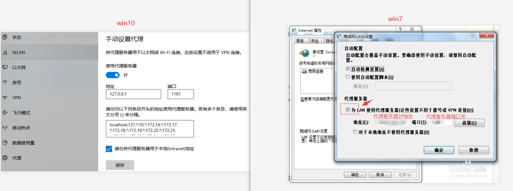
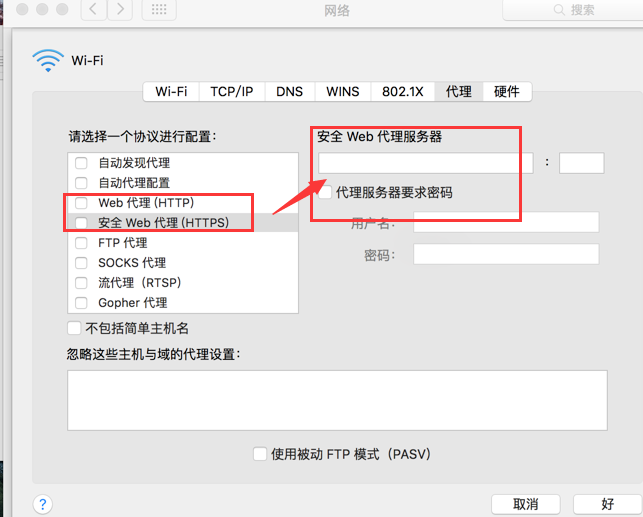

# 卸载与恢复网络

由于应用启动后会自动设置系统代理，正常退出/关机时会关闭系统代理。
当应用意外关闭，或者未正常退出后被卸载，此时会因为系统代理没有恢复从而导致完全上不了网。

## 恢复代理设置

### 1、windows 代理关闭

如何打开查看windows代理设置：

- win10/win11: 开始->设置->网络和Internet->代理->手动设置代理->使用代理服务器，点击右边的编辑按钮，关掉“使用代理服务器”的开关
- win7/win8/win8.1: 开始->控制面板->网络和Internet->网络和共享中心->左下角Internet选项->连接选项卡->局域网设置

### 2、mac 代理关闭

网络->网卡->代理->去掉http和https的两个勾

### 3、Linux（Ubuntu）

网络->代理->选择禁用
